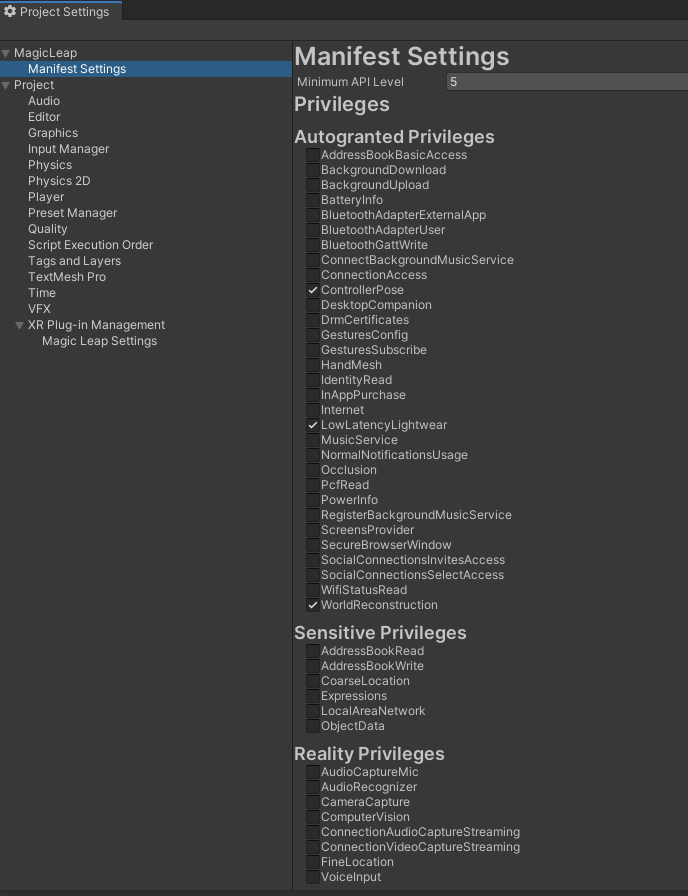
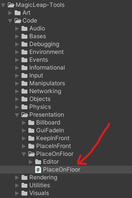
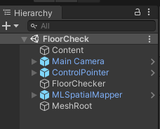
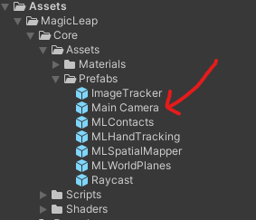
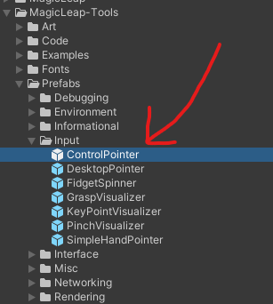
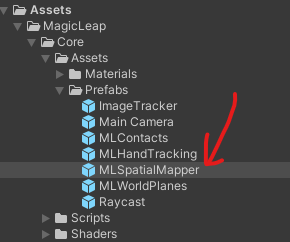
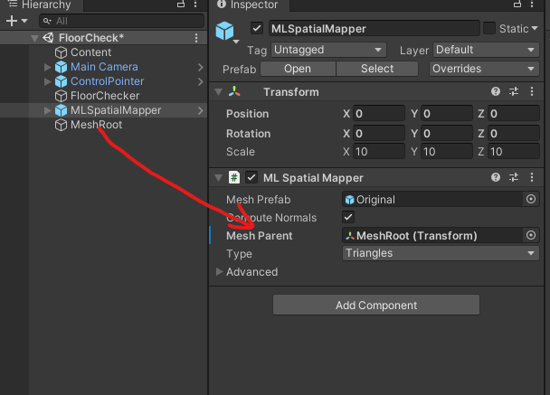
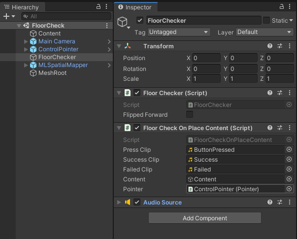
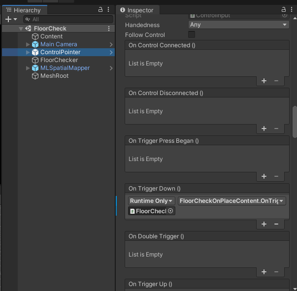

## 開発環境
Unity : 2019.3.7f1  
LuminOS : 0.98.11, APILevel 8  
MagicLeap : UnitySDK 0.24.1  
MagicLeap : ToolKit 特にバージョン表記等はないので現時点(2020/09/22)での最新

[MagicLeapToolKitのDLはこちらから](https://github.com/magicleap/Magic-Leap-Toolkit-Unity/blob/master/package/MagicLeap-Tools.unitypackage)  

今回開発したアプリの[リポジトリ](https://github.com/RyusukeMatsumoto7C9-B-2/MagicLeap-SandBox/tree/master/MagicLeapSandBox)はこちら  
FloorCheckシーンにサンプルが配置してあります


## 完成するもの

<blockquote class="twitter-tweet"><p lang="ja" dir="ltr">床を判定するやつ <a href="https://t.co/zzhb4lk5g2">pic.twitter.com/zzhb4lk5g2</a></p>&mdash; 松本隆介 (@matsumotokaka11) <a href="https://twitter.com/matsumotokaka11/status/1308091761445597184?ref_src=twsrc%5Etfw">September 21, 2020</a></blockquote>


## 下準備

```ProjectSettings > MagicLeap > ManifestSettings```にて以下の項目にチェックを入れました

- ControllerPose
- LowLatencyLightwear
- WorldReconstruction




## スクリプト等

今回のスクリプトはMagicLeap ToolKitのPlaceOnFloorを改造したものです




素のPlaceOnFloorのままだと初回の床判定以降は床判定を行わないので何度でも床判定を行えるようにしました。

---

### 改造したFloorChecker.cs

```csharp

using System.Collections;
using System.Collections.Generic;
using UnityEngine;

#if PLATFORM_LUMIN
using UnityEngine.XR.MagicLeap;
#endif


namespace FloorCheck
{
    /// <summary>
    /// MagicLeapToolsのFloorOnPlaceを改造したクラス.
    /// 床検知を何度もにできるようにする.
    /// </summary>
    public class FloorChecker : MonoBehaviour
    {
        readonly float HeadLocationIdleThreshold = 0.003f;
        readonly float HeadRotationIdleThreshold = .3f;
        readonly int HistoryCount = 5;
        readonly float HeadIdleRequiredDuration = .2f;
        
        // Public Properties:
        public Vector3 Location
        {
            get;
            private set;
        }

        
        [Tooltip("Does content's content match it's transform forward?")]
        [SerializeField] bool flippedForward;
        

        List<Vector3> headLocationHistory;
        List<Quaternion> headRotationHistory;
        float headLocationVelocity;
        float headRotationVelocity;
        Transform mainCamera;
        bool headLocationIdle;
        bool headRotationIdle;
        bool headTemporarilyIdle;
        bool headIdle;
        bool placementValid;
        

        //Init:
        void Awake()
        {
            //refs:
            mainCamera = Camera.main.transform;

            //requirements:
            if (FindObjectOfType<MLSpatialMapper>() == null)
            {
                Debug.LogError("PlaceOnFloor requires and instance of the MLSpatialMapper in your scene.");
            }
        }
        

        //Flow:
        void OnEnable()
        {
            //sets:
            headLocationHistory = new List<Vector3>();
            headRotationHistory = new List<Quaternion>();
        }

        
        //Loops:
        void Update()
        {
            //let headpose warmup a little:
            if (Time.frameCount < 3)
            {
                return;
            }

            HeadActivityDetermination(); 
        }
        

        //Coroutines:
        IEnumerator HeadIdleTimeout()
        {
            yield return new WaitForSeconds(HeadIdleRequiredDuration);
            headIdle = true;
        }

        
        void HeadActivityDetermination()
        {
            //history:
            headLocationHistory.Add(mainCamera.position);
            if (HistoryCount < headLocationHistory.Count)
                headLocationHistory.RemoveAt(0);

            headRotationHistory.Add(mainCamera.rotation);
            if (HistoryCount < headRotationHistory.Count)
                headRotationHistory.RemoveAt(0);

            //location velocity:
            if (headLocationHistory.Count == HistoryCount)
            {
                headLocationVelocity = 0;
                for (int i = 1; i < headLocationHistory.Count; i++)
                {
                    headLocationVelocity += Vector3.Distance(headLocationHistory[i], headLocationHistory[i - 1]);
                }
                headLocationVelocity /= headLocationHistory.Count;

                //idle detection:
                if (headLocationVelocity <= HeadLocationIdleThreshold)
                {
                    if (!headLocationIdle)
                    {
                        headLocationIdle = true;
                    }
                }
                else
                {
                    if (headLocationIdle)
                    {
                        headLocationIdle = false;
                    }
                }
            }

            //rotation velocity:
            if (headRotationHistory.Count == HistoryCount)
            {
                headRotationVelocity = 0;
                for (int i = 1; i < headRotationHistory.Count; i++)
                {
                    headRotationVelocity += Quaternion.Angle(headRotationHistory[i], headRotationHistory[i - 1]);
                }
                headRotationVelocity /= headRotationHistory.Count;

                //idle detection:
                if (headRotationVelocity <= HeadRotationIdleThreshold)
                {
                    if (!headRotationIdle)
                    {
                        headRotationIdle = true;
                    }
                }
                else
                {
                    if (headRotationIdle)
                    {
                        headRotationIdle = false;
                    }
                }
            }

            //absolute idle head determination:
            if (headLocationIdle && headRotationIdle)
            {
                if (!headTemporarilyIdle)
                {
                    headTemporarilyIdle = true;
                    StartCoroutine(HeadIdleTimeout());
                }
            }
            else
            {
                if (headTemporarilyIdle)
                {
                    headIdle = false;
                    headTemporarilyIdle = false;
                    StopCoroutine(HeadIdleTimeout());
                }
            }
        }
   
        
        /// <summary>
        /// 指定したRayの位置に床があるか否か、ある場合はその座標も返す.
        /// </summary>
        /// <param name="ray"></param>
        /// <returns></returns>
        public (bool, Vector3) LookingAtFloorDetermination(
            Ray ray)
        {
            //cast to see if we are looking at the floor:
            RaycastHit hit;
            if (Physics.Raycast(ray, out hit))
            {
                MagicLeapTools.SurfaceType surface = MagicLeapTools.SurfaceDetails.Analyze(hit);
                
                if (surface == MagicLeapTools.SurfaceType.Floor)
                {
                    Location = hit.point;
                    placementValid = true;
                    return (true, Location);
                }
                else
                {
                    placementValid = false;
                    return (false, Vector3.zero);
                }
            }
            else
            {
                placementValid = false;
                return (false, Vector3.zero);
            }
        }

        
    }
}
```

---

### FloorCheckerを利用するFloorCheckOnPlaceContent.cs

```csharp
using System;
using MagicLeapTools;
using UnityEngine;

namespace FloorCheck
{
    
    /// <summary>
    /// トリガを入力したときに床を判定し、床の場合はオブジェクトを配置するサンプル.
    /// </summary>
    [RequireComponent(typeof(FloorChecker),typeof(AudioSource))]
    public class FloorCheckOnPlaceContent : MonoBehaviour
    {

        [SerializeField] AudioClip pressClip;
        [SerializeField] AudioClip successClip;
        [SerializeField] AudioClip failedClip;
        [SerializeField] GameObject content;
        [SerializeField] Pointer pointer;
        FloorChecker floorChecker;
        AudioSource audio;

        
        void Start()
        {
            floorChecker = GetComponent<FloorChecker>();
            audio = GetComponent<AudioSource>();
        }


        public void OnTriggerDown()
        {
            audio.PlayOneShot(pressClip);
            (bool onFloor, Vector3 pos ) result = floorChecker.LookingAtFloorDetermination(new Ray(pointer.Origin, pointer.Direction));
            if (result.onFloor)
            {
                audio.PlayOneShot(successClip);
                content.transform.position = result.pos;
            }
            else
            {
                audio.PlayOneShot(failedClip);
            }
        }


    }
}
```


## シーンの構成

シーンの構成は以下の画像の通りになっています



---

MainCameraは ```Assets > MagicLeap > Core > Assets > Prefabs``` にある物を使いました




---

ControlPointerは ```Assets > MagicLeap-Tools > Prefabs > Input``` から




---

今回はSpatialMapperを表示してどのメッシュの判定が通っているかをわかりやすくするので ```Assets > MagicLeap > Core > Assets > Prefabs``` のMLSpatialMapperも利用します



MLSpatialMapperにはメッシュを生成するルートとなるオブジェクトが必要なのでシーン上にMeshRootオブジェクトを作成しそれをあてがっています




---

FloorCheckerを利用するクラス等はこのような構成になります
効果音は[魔王魂](https://maoudamashii.jokersounds.com/)さんから拝借




トリガ入力に対応して床判定を行うためにControlPointerのイベントにFloorCheckOnPlaceContentのOnTriggerDownを登録しています




## 完成

実機にビルド or ZeroIterationで動作確認をすれば

<blockquote class="twitter-tweet"><p lang="ja" dir="ltr">床を判定するやつ <a href="https://t.co/zzhb4lk5g2">pic.twitter.com/zzhb4lk5g2</a></p>&mdash; 松本隆介 (@matsumotokaka11) <a href="https://twitter.com/matsumotokaka11/status/1308091761445597184?ref_src=twsrc%5Etfw">September 21, 2020</a></blockquote>

これで床を判定し、床だけに配置したいオブジェクトとかの実装ができるようになります

## 感想

この判定を使えば床判定の入ってるメッシュだけAgentのNavMeshを晴れたりできるかも?

まだやってない、出来たら記事にするかもしれません
