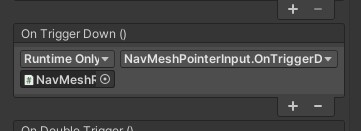
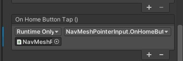
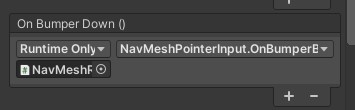
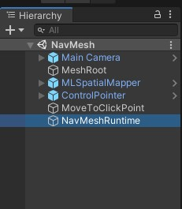
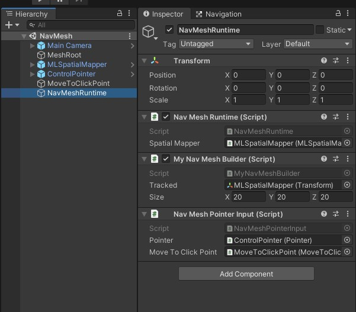
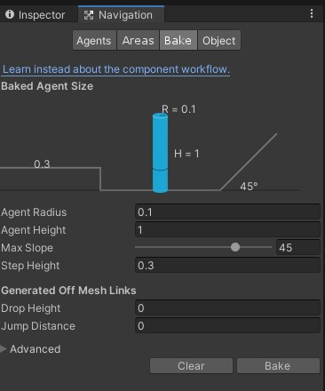
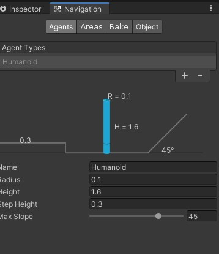

以前HoloLensのランタイムに生成したメッシュにNavMeshを張り付けてオブジェクトを動かす記事があったのでMagicLeapのSpatialMapにも使えるのでは?と思い試してみた

記事は[ここ](https://qiita.com/morio36/items/d75228d2ccdb9c24574b#%E5%AE%8C%E6%88%90%E3%82%A4%E3%83%A1%E3%83%BC%E3%82%B8)


---

## 完成するもの

<blockquote class="twitter-tweet"><p lang="ja" dir="ltr">MagicLeapのSpatialMapにランタイムにNavMeshを張り付けて動いてもらうやつ <a href="https://t.co/wfBLTrH8ac">pic.twitter.com/wfBLTrH8ac</a></p>&mdash; 松本隆介 (@matsumotokaka11) <a href="https://twitter.com/matsumotokaka11/status/1308779823276240898?ref_src=twsrc%5Etfw">September 23, 2020</a></blockquote>

---

## 開発環境

Unity : 2019.3.7f1  
LuminOS : 0.98.11, APILevel 8  
MagicLeap : UnitySDK 0.24.1  
MagicLeap : ToolKit 特にバージョン表記等はないので現時点(2020/09/22)での最新

[MagicLeapToolKitのDLはこちらから](https://github.com/magicleap/Magic-Leap-Toolkit-Unity/blob/master/package/MagicLeap-Tools.unitypackage)  

今回開発したアプリの[リポジトリ](https://github.com/RyusukeMatsumoto7C9-B-2/MagicLeap-SandBox/tree/master/MagicLeapSandBox)はこちら  
Navigationシーンにサンプルが配置してあります


## スクリプト


### MyNavMeshBuilder.cs
```csharp

using UnityEngine;
using UnityEngine.AI;
using System.Collections;
using System.Collections.Generic;
using NavMeshBuilder = UnityEngine.AI.NavMeshBuilder;

namespace SandBox.Navigation
{
    // Build and update a localized navmesh from the sources marked by NavMeshSourceTag
    [DefaultExecutionOrder(-102)]
    public class MyNavMeshBuilder : MonoBehaviour
    {
        // The center of the build
        public Transform m_Tracked;

        // The size of the build bounds
        public Vector3 m_Size = new Vector3(80.0f, 20.0f, 80.0f);

        NavMeshData m_NavMesh;
        AsyncOperation m_Operation;
        NavMeshDataInstance m_Instance;
        List<NavMeshBuildSource> m_Sources = new List<NavMeshBuildSource>();

        IEnumerator Start()
        {
            while (true)
            {
                UpdateNavMesh(true); // このメソッドを呼び出し続ける
                yield return m_Operation;
            }
        }

        void OnEnable()
        {
            // Construct and add navmesh
            m_NavMesh = new NavMeshData();
            m_Instance = NavMesh.AddNavMeshData(m_NavMesh);
            if (m_Tracked == null)
                m_Tracked = transform;
            UpdateNavMesh(false);
        }

        void OnDisable()
        {
            // Unload navmesh and clear handle
            m_Instance.Remove();
        }

        void UpdateNavMesh(bool asyncUpdate = false)
        {
            MyNavMeshSourceTag.Collect(ref m_Sources);    //←NavMeshSourceTagタグをセットしたオブジェクトをすべて集めてListに格納
            var defaultBuildSettings = NavMesh.GetSettingsByID(0);
            var bounds = QuantizedBounds();   //←メッシュ生成の範囲をセット

            if (asyncUpdate)
                m_Operation = NavMeshBuilder.UpdateNavMeshDataAsync(m_NavMesh, defaultBuildSettings, m_Sources, bounds);    //←実際のメッシュ生成を行っている部分。
            else
                NavMeshBuilder.UpdateNavMeshData(m_NavMesh, defaultBuildSettings, m_Sources, bounds);
        }

        static Vector3 Quantize(Vector3 v, Vector3 quant)
        {
            float x = quant.x*Mathf.Floor(v.x/quant.x);
            float y = quant.y*Mathf.Floor(v.y/quant.y);
            float z = quant.z*Mathf.Floor(v.z/quant.z);
            return new Vector3(x, y, z);
        }

        Bounds QuantizedBounds()
        {
            // Quantize the bounds to update only when theres a 10% change in size
            var center = m_Tracked ? m_Tracked.position : transform.position;
            return new Bounds(Quantize(center, 0.1f*m_Size), m_Size);
        }

        void OnDrawGizmosSelected()
        {
            if (m_NavMesh)
            {
                Gizmos.color = Color.green;
                Gizmos.DrawWireCube(m_NavMesh.sourceBounds.center, m_NavMesh.sourceBounds.size);
            }

            Gizmos.color = Color.yellow;
            var bounds = QuantizedBounds();
            Gizmos.DrawWireCube(bounds.center, bounds.size);

            Gizmos.color = Color.green;
            var center = m_Tracked ? m_Tracked.position : transform.position;
            Gizmos.DrawWireCube(center, m_Size);
        }
    }
}

    
```

---

### MyNavMeshSourceTag.cs

```csharp
using UnityEngine;
using UnityEngine.AI;
using System.Collections.Generic;


namespace SandBox.Navigation
{
    
    // Tagging component for use with the LocalNavMeshBuilder
    // Supports mesh-filter and terrain - can be extended to physics and/or primitives
    [DefaultExecutionOrder(-200)]
    public class MyNavMeshSourceTag : MonoBehaviour
    {
        // Global containers for all active mesh/terrain tags
        public static List<MeshFilter> m_Meshes = new List<MeshFilter>();
        public static List<Terrain> m_Terrains = new List<Terrain>();
        

        void OnEnable()
        {
            var m = GetComponent<MeshFilter>();
            if (m != null)
            {
                m_Meshes.Add(m);
            }

            var t = GetComponent<Terrain>();
            if (t != null)
            {
                m_Terrains.Add(t);
            }

        }

        void OnDisable()
        {
            var m = GetComponent<MeshFilter>();
            if (m != null)
            {
                m_Meshes.Remove(m);
            }

            var t = GetComponent<Terrain>();
            if (t != null)
            {
                m_Terrains.Remove(t);
            }

        }

        // Collect all the navmesh build sources for enabled objects tagged by this component
        public static void Collect(ref List<NavMeshBuildSource> sources)
        {
            sources.Clear();

            for (var i = 0; i < m_Meshes.Count; ++i)
            {
                var mf = m_Meshes[i];
                if (mf == null) continue;

                var m = mf.sharedMesh;
                if (m == null) continue;

                var s = new NavMeshBuildSource();
                s.shape = NavMeshBuildSourceShape.Mesh;
                s.sourceObject = mf.mesh;
                s.transform = mf.transform.localToWorldMatrix;
                s.area = 0;
                sources.Add(s);
            }
            
            for (var i = 0; i < m_Terrains.Count; ++i)
            {
                var t = m_Terrains[i];
                if (t == null) continue;

                var s = new NavMeshBuildSource();
                s.shape = NavMeshBuildSourceShape.Terrain;
                s.sourceObject = t.terrainData;
                // Terrain system only supports translation - so we pass translation only to back-end
                s.transform = Matrix4x4.TRS(t.transform.position, Quaternion.identity, Vector3.one);
                s.area = 0;
                sources.Add(s);
            }

        }
    }

}

```

---


この辺りまでは先述した記事とほぼ同じ

MagicLeapはHoloLensとは空間メッシュの取得方法が違うのでここから少しアレンジが入ります


### NavMeshRuntime.cs
```csharp
using UnityEngine;
using UnityEngine.XR.MagicLeap;

namespace SandBox.Navigation
{
    /// <summary>
    /// ランタイムに生成された空間メッシュにMyNavMesySourceTagをアタッチし、ランタイムにNavMeshを作成する機能に処理してもらう.
    /// </summary>
    public class NavMeshRuntime : MonoBehaviour
    {
        [SerializeField] MLSpatialMapper spatialMapper;

        void Start()
        {
            // ここでSpatialMapperのメッシュが追加された際に該当するidのメッシュにMyNavMeshSourceTagをアタッチしている.
            spatialMapper.meshAdded += (id) =>
                {
                    spatialMapper.meshIdToGameObjectMap[id].AddComponent<MyNavMeshSourceTag>();
                } ;
        }
    }
}
```

MLSpatialMapperのmeshAdded イベントにコールバックを登録し、メッシュが追加されたら取得したidから追加されたメッシュオブジェクトにMyNavMeshSourceTagをアタッチします、アタッチ後の内部動作はHoloLensの方の記事と同様なので大きな違いはここになります


---

次に指定した座標に移動するオブジェクトのスクリプト

### MoveToClickPoint.cs
```csharp
using UnityEngine;
using UnityEngine.AI;

namespace SandBox.Navigation
{
    public class MoveToClickPoint : MonoBehaviour
    {
        NavMeshAgent agent;

        // パス、座標リスト、ルート表示用Renderer
        NavMeshPath path = null;
        Vector3[] positions = new Vector3[9];

    
        public LineRenderer lr;


        void Start()
        {
            agent = GetComponent<NavMeshAgent>();
            lr.enabled = false;
        }


        public void SetPosition(
            Vector3 position)
        {
            agent.enabled = false;
            transform.position = position;
            agent.enabled = true;
        }
    

        public void OnInputClicked(
            Vector3 position)
        {
            lr.enabled = true;

            // 目的地の設定.
            agent.destination = position;

            // パスの計算.
            path = new NavMeshPath();
            NavMesh.CalculatePath(agent.transform.position, agent.destination, NavMesh.AllAreas, path);
            positions = path.corners;

            // ルートの描画.
            lr.widthMultiplier = 0.2f;
            lr.positionCount = positions.Length;

            for (int i = 0; i < positions.Length; i++) {
                Debug.Log("point "+i+"="+ positions[i]);

                lr.SetPosition(i, positions[i]);

            }
        }

    }

}

```

---

最後にコントローラから指定した座標にオブジェクトが移動してもらえるようにする入力スクリプト

### NavMeshPointerInput.cs
```csharp
using MagicLeapTools;
using UnityEngine;


namespace SandBox.Navigation
{
    public class NavMeshPointerInput : MonoBehaviour
    {

        [SerializeField] Pointer pointer;
        [SerializeField] MoveToClickPoint moveToClickPoint;
        

        /// <summary>
        /// Trigger押下処理,指定した座標にAgentが移動するようにしている.
        /// </summary>
        public void OnTriggerDown()
        {
            RaycastHit hit;
            if (Physics.Raycast(new Ray(pointer.Origin, pointer.Direction), out hit))
            {
                moveToClickPoint.OnInputClicked(hit.point);
            }
        }


        /// <summary>
        /// Bumperボタン押下処理.
        /// 指定した座標にAgentを配置しなおすために利用.
        /// </summary>
        public void OnBumperButtonDown()
        {
            RaycastHit hit;
            if (Physics.Raycast(new Ray(pointer.Origin, pointer.Direction), out hit))
            {
                moveToClickPoint.SetPosition(hit.point);
            }
        }


        /// <summary>
        /// HomeButton押下処理.
        /// 実機動作時にアプリを終了させるため.
        /// </summary>
        public void OnHomeButtonDown()
        {
            Application.Quit();
        }

    }

}

```

其々のボタン押下メソッドはControllPointerオブジェクトのControllInputコンポーネントの該当するイベントに登録します

  
  
  


---

## シーンの構成


シーンの構成はシンプルにしています、SpatialMap確認用にMLSpatialMapperを利用しておりコントローラの入力はCOntrollPointerを利用しています




今回作成したスクリプトのうち
- NavMeshRuntime
- NavMeshPointerInput
- MyNavMeshBuilder

の三つはNavMeshRuntimeにまとめてアタッチ




指定した座標に移動するAgentはヒエラルキー上に適当な大きさのシリンダーを配置し

- NavMeshAgent
- MoveToClickPoint

のコンポーネントをアタッチ

---

NavMeshの設定は以下の画像の通りです、部屋が狭いので細かくしました

  



---

## デプロイ

これでデプロイして動作確認すると↓の動画のようになります、トリガー押下で指定した座標にシリンダーが移動し、バンパーボタン押下で指定した座標にシリンダーを配置しなおす
ホームボタンでアプリを終了します

<blockquote class="twitter-tweet"><p lang="ja" dir="ltr">MagicLeapのSpatialMapにランタイムにNavMeshを張り付けて動いてもらうやつ <a href="https://t.co/wfBLTrH8ac">pic.twitter.com/wfBLTrH8ac</a></p>&mdash; 松本隆介 (@matsumotokaka11) <a href="https://twitter.com/matsumotokaka11/status/1308779823276240898?ref_src=twsrc%5Etfw">September 23, 2020</a></blockquote>

---


