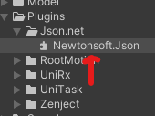

個人的なメモ

## 導入

普段はJsonUtilityを利用しているが知り合いのエンジニア曰くJson.netは割とメジャーとのことなので利用できるツールは多いほうがいいの精神の素Json.netも扱えるようにしてみた。

[こちらのリポジトリ](https://github.com/JamesNK/Newtonsoft.Json)のReleaseからzipファイルをDLし解凍する。

解凍したファイルの中の net20 の中にある ```Newtonsoft.Json.dll``` ファイルを Unity プロジェクトの Plugins ディレクトリに移動する



これだけで利用できる、簡単！


## 実際の使い方

usingディレクティブを追加
```csharp

using Newtonsoft.Json;

```


例 : データのシリアライズ

```csharp

public class Hoge
{
    [JsonProperty] private string name;
    public string Name => name;

    public Hoge(string _name)
    {
        name = _name;
    }
}

private void SerializeData()
{
    var a = new Hoge("Name-Hoge");
    string json = JsonConvert.SerializeObject(a);
}


```


例 : データのデシリアライズ、ローカルにあるJsonファイルの文字列をHogeクラスにデシリアライズ

```csharp

private void DeserializeData()
{
    using (var sr = new StreamReader(ResourceListFilePath))
    {
        string data = await sr.ReadToEndAsync();
        UnityEngine.Debug.Log($"data {data}");
        localData = JsonConvert.DeserializeObject<Hoge>(data);
    }

}

```

## 感想

意外と簡単に導入できた、がJsonUtilityのノリで```[SerializeField]```属性をつけたprivateフィールドはデシリアライズできない点を知らずに結構な時間を要した  
あとダウンロードしてきたJsonファイルをUTF-8にエンコードしたらデシリアライズできなかった <- これは後で調べる必要がありそう