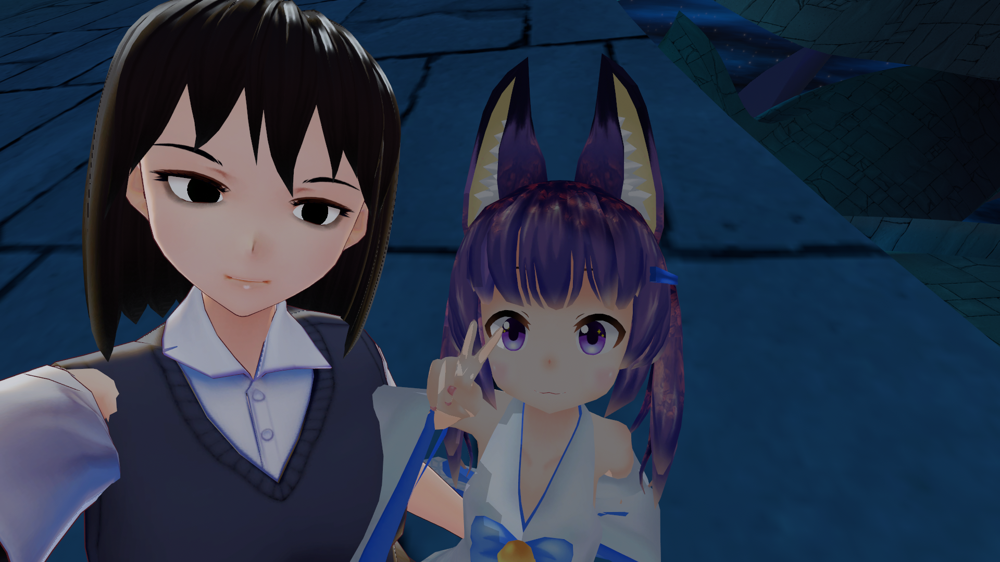
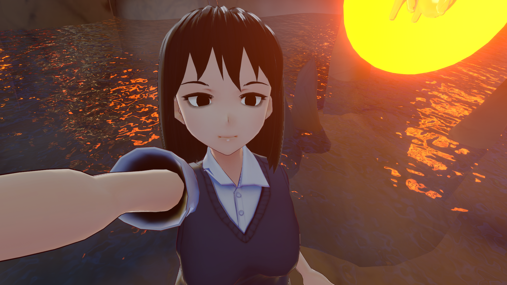
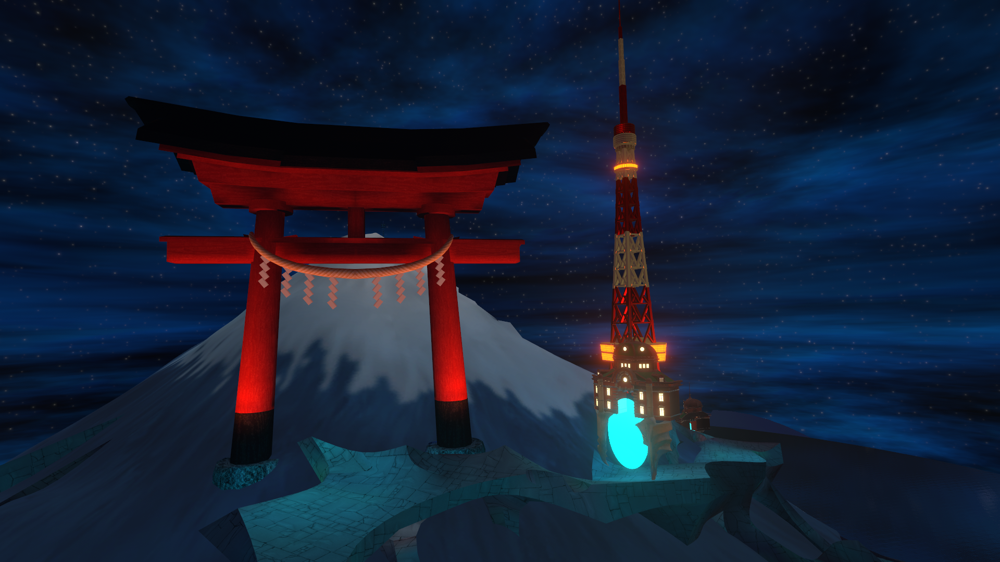
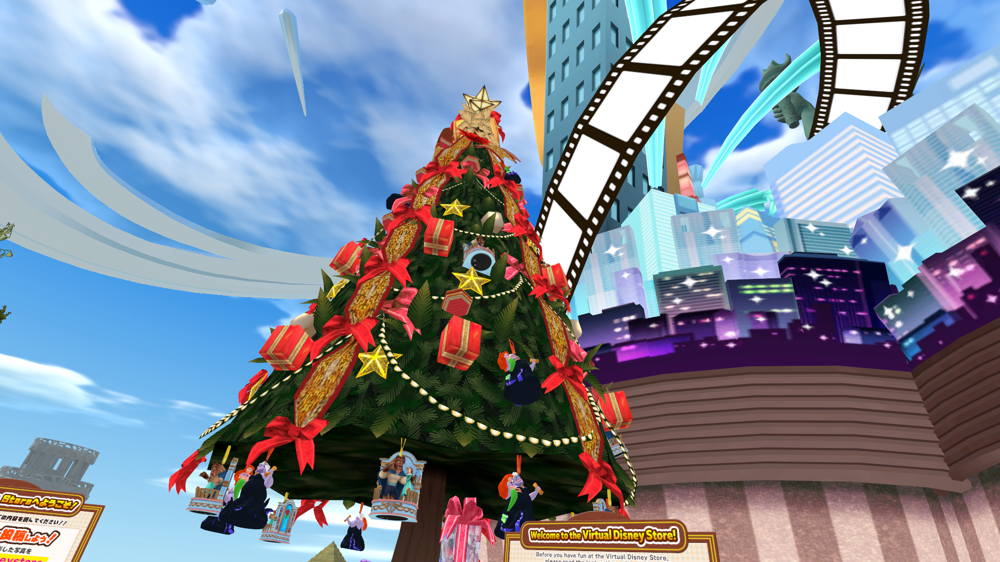
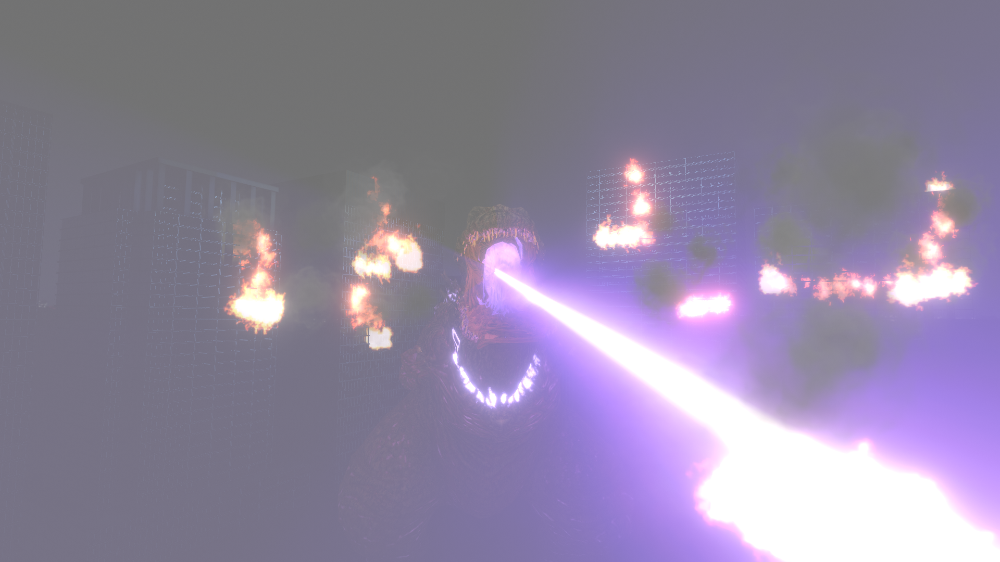
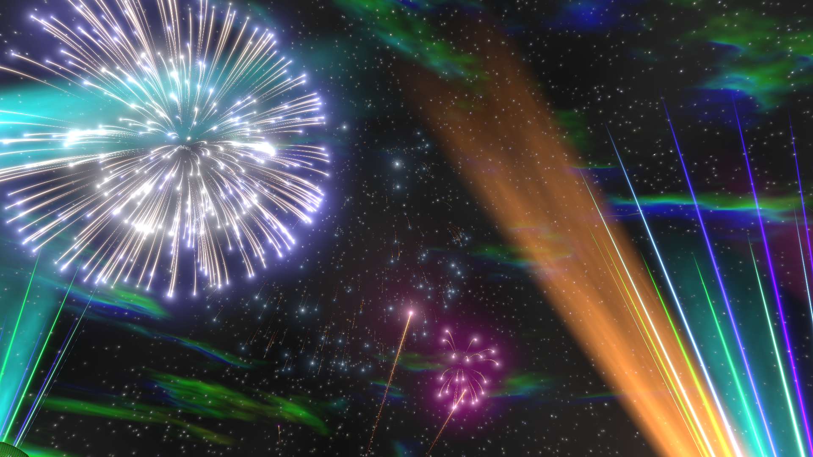

# 備忘録

[ここ](https://note.com/imawamada_seiga/n/n9f9a334d18b3)の記事の通りに進めれば大丈夫

# 手順 ( 後で追記する )

- VRCに対応しているUnityバージョンをUnityHubよりインストール
- [VRCのダウンロードから](https://vrchat.com/home/download)VRCHAT SDKをダウンロード、バージョンは都度調べておく
- [BOOTH](https://booth.pm/ja/items/1025226)のページからVRM Converter for VRChatのUnityPackageをダウンロード
- Unityで新規にプロジェクトを作成し、VRCHAT SDKとVRM Converter for VRChatをインポート
- 揺れものを使いたい人はDynamic Boneを購入して利用してもいいかも

# VRChatへ

久しぶりにVRChatへ入った、ちょうどVketの時期でいろいろな出展ブースを眺めながらクリスマス気分に浸ることが出来てよかったわよ
後花火がきれいだった

今度モデルのボディをツナギに自作したり表情の調整とかをしなきゃならないなー
