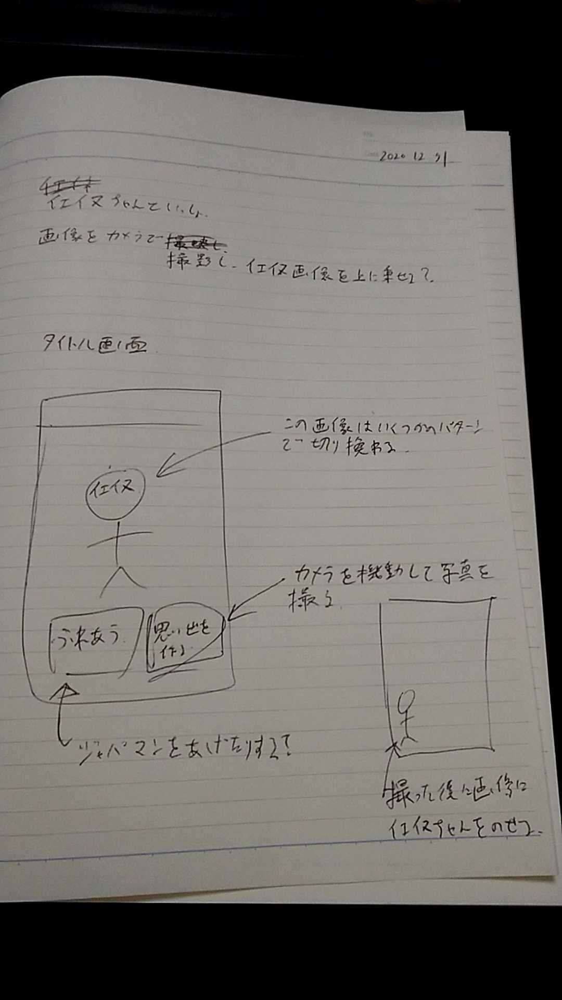

今日から来年の業務開始までの間での社内ゲームジャム ( 勝手にイベント作って勝手に進行してる )やつを本格的に開始してる

企画書はこんな感じ

↓今後このツイートのスレッドで進捗とかつぶやいてく
<blockquote class="twitter-tweet">
一人で勝手にやってる社内ゲームジャムの進捗、とりあえずタイトル画面が出来た <a href="https://t.co/6ZF2wXWIed">pic.twitter.com/6ZF2wXWIed</a>
&mdash; 松本隆介 (@matsumotokaka11) <a href="https://twitter.com/matsumotokaka11/status/1344531074009845760?ref_src=twsrc%5Etfw">December 31, 2020</a></blockquote>

今日はここまで出来た
<blockquote class="twitter-tweet">
今日の成果、Flutterだいぶわかってきたぞ <a href="https://t.co/2CYXLaLY38">pic.twitter.com/2CYXLaLY38</a>
&mdash; 松本隆介 (@matsumotokaka11) <a href="https://twitter.com/matsumotokaka11/status/1344562408157708288?ref_src=twsrc%5Etfw">December 31, 2020</a></blockquote>

---
## 以下参考資料リンク

[Flutter で Button の背景に画像を設定する](https://qiita.com/tktcorporation/items/a7946e0e0e9b07d76572)  
[Flutter 画面遷移のやり方](https://qiita.com/kono-hiroki/items/b1a8f19dfab371e7816d)  
[Flutterで写真を取得したい君に](https://qiita.com/toshinobu111/items/ea7556adfa5545e26e76)  
[画像を表示する](https://nzigen.com/flutter-reference/2018-04-16-image.html)  
[【Flutter】背景いっぱいに画像を表示する - あぼぼノート](https://aboy-perry.hatenablog.com/entry/flutter-backgroundimage)  

## 素材はここから
[けもフレっぽい背景](https://seiga.nicovideo.jp/seiga/im6596397)  
[けものフレンズロゴジェネレータ!](https://aratama.github.io/kemonogen/)  
