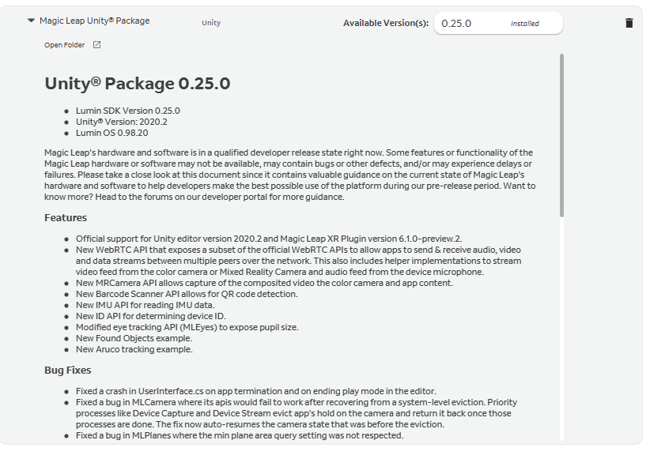
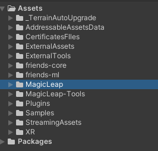
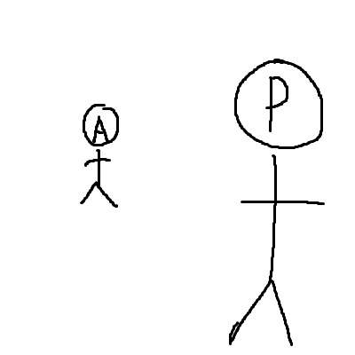
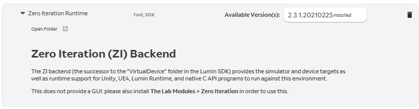
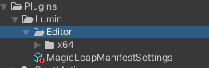
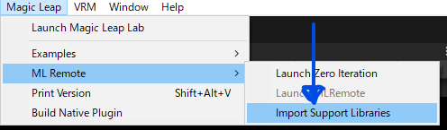

昨年末よりクローン病の再燃でかなり体調が悪化してて活動控え気味だったけど年度も変わったし新しい薬も効き目は鈍いけど常にあった倦怠感や発熱、眩暈は取れたからそろそろ活動しようかなと思ってる。

久しぶりにMagicLeapをいじることにした。
とりあえず最近MagicLeapのSDKがバージョンアップしたのでそれに対応したUnity2020.2系にプロジェクトをアップグレード。

MagicLeapの0.25.0のSDKパッケージを上書きインポートした際に結構な数のエラーが出たのでもしかしたら上書きアップデートはやらないほうがいいのかもしれない。
素直にMagicLeapフォルダごと削除してインポートしなおしたら問題なくアプリをビルドすることが出来た。

今現在作ってるオレオレ箱庭お遊びプロジェクトではVRMモデルをフルサイズ( 1.6m位 )で描画してるけどこれ結構画角的にもギリギリだったりするのでこれをまずはどうにかしたいなと思ってる。
今後はVRMモデルを↓これくらいのサイズ感にしようかなと、その前に作るだけ作って溜まってるissueをどうにかしないといけない。

後なんかプロジェクトとSDKをアップデートしたらZero Iterationが出来なくなった、いろいろごにょごにょやった結果、先ずThe LabからZero Iteration用のパッケージを最新のものに更新( Backendのやつも同じく更新 )

その後Unityプロジェクトをいったん閉じて　"""Assets > Plugins > Lumin > Editor """ を削除する、( Unityを開いてる状態だとファイルを開いてるため削除できませんのダイアログが出る )

そして再度Unityを開き、 """ MagicLeap > ML Remote > Import Support Libraries """ を実行するとZero Iterationが利用できるようになる。

実際この手順はUnityぷろじぇくとで初回Zero Iterationを実行するときの手順とほぼ同じ、おそらく古いバージョンのZero Iterationのキャッシュなどが残ってるのが原因で新しいバージョンのZero Iterationが実行できないって感じの状態なんだと思う。
んで実行時に利用するDLL部分を一度削除し、最新のZero Iterationの状態でDLLを出力しなおすと利用できる...みたいな

