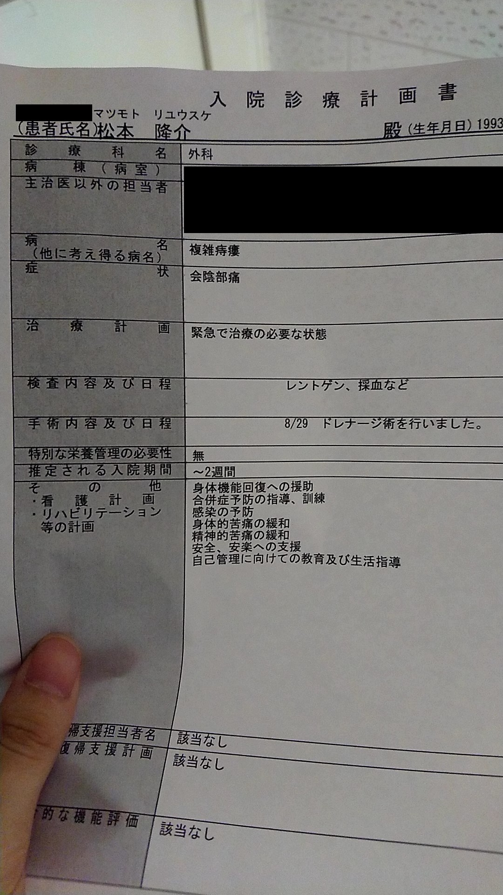
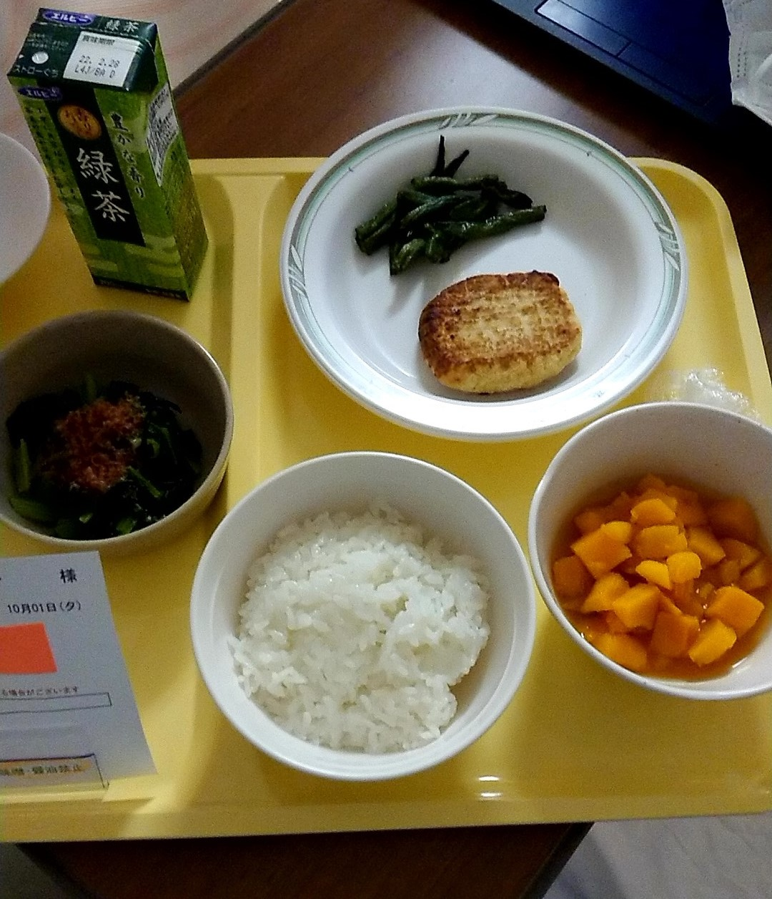

## 8月29日から入院開始して一か月経過

去年の12月あたりから体調があまり良くなかったが今年の6月あたりからだいぶ体調が悪化した。
お尻に違和感が出始め肛門周囲膿瘍を疑い早めに病院に受診、抗生剤で何とかなる段階だといわれ抗生剤を処方してもらい服用してからは違和感の部位も小さくなっていった。

同時にクローン病のほうも少しずつ容体が悪化し、12月からレミケードをヒュミラに変えてもらったが下痢が収まらずそれが原因で肛門周囲膿瘍になったと思われる、クローン病のメインの症状としてある腹痛はヒュミラに変更してからは全く起きず下痢だけが残ってる状態が続いた。

8月に入ってから熱が37℃ ~ 40℃出るようになり同時にお尻のほうの違和感も大きくなる、あまりの激痛に耐え切れず8月の29日に救急外来を受診した結果複雑痔瘻の診断がおり緊急手術&緊急入院となった。

この手術も一応切開するところを局所麻酔したが既に腫れているところは布がこすれただけでも飛び上がるくらいの激痛のため体内の膿を排出するときの圧迫による激痛で号泣、子供のように泣き叫んだのは文字どおり子供のころ以来、もう尻周りの治療とかがトラウマになった。  
実際なんかお尻に処置するって話になったとたんに血の気が引けて呼吸も早くなる状態が続いている、ペンローズ( 切開したところから膿が出きるまで刺してる管 )の洗浄だけはもう慣れたが切開と聞くとまだ震えが起きる。

## 9月**日 ( 日時忘れちゃった )新たな膿瘍が見つかる

入院してしばらく安静にしていたがベッドで横になるとお尻に少し違和感があり、朝の回診の際に伝えたら新しい膿瘍が出来てるとのことでその日の昼頃に切開 ( 当然この時も体がブルブル震えていた )。  
ただ早期に見つかった膿瘍のため局所麻酔自体も大した痛みもなく割とあっさり終わった、切開の途中はずっと看護師さんに背中をさすってもらいながら震えをこらえてたけど。  
経験者ならわかるけど局所麻酔をすること自体が結構痛い、麻酔をするための麻酔が欲しい。

**俺は次男だからもうこの激痛を我慢したくない。**

## 9月**日 ( また日時忘れた )熱が出始める

入院直後は絶食治療だったが途中から固形食が始まった、思いのほか食欲がわかず出された量の半分を食べるのでやっとだった。  
その日の夜あたりから熱が出始めここから一週間ずっと40℃の発熱に苦しめられた、ただ不思議と意識ははっきりしていたためトイレ等は一人でトイレまで移動して用を足していた。

## 10月1日 再度固形食開始

9月の27日から半固形食でゼリーやらプリンやら豆腐やらを食べていたがついに今日固形食が解禁された、昔から病院食は不味い不味いってよく言われてるけど普通においしかった。  
これで熱が出なければあとは下痢が収まるまでひたすら休養を取って退院って流れになると思う、それまでの道のりが凄く長いと思うが。

## ポケットWiFi到着

今日ポケットWiFiが到着したのでこれからゴージャス☆入院生活になると期待していたが速度を計測したら... ( ﾟдﾟ)

退院への道のりは険しいものになりそう。
