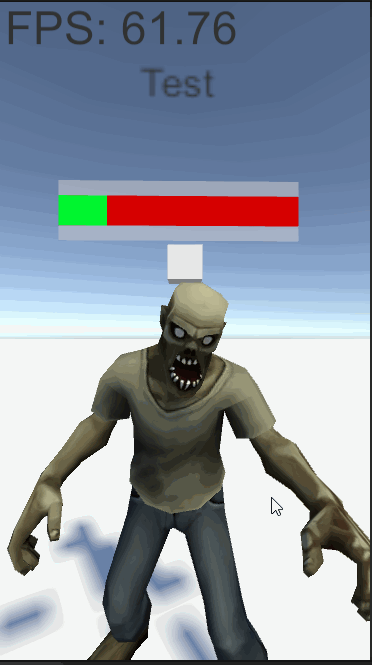

入院中の暇な時間ちょっとしたゲームでも作って暇つぶししてようかと思って開発中。



DI周りは仕事ではZenjectを使うことが多いけど今回はせっかくだしVContainerを使ってみようかと思う、[前にさわったことがある](https://qiita.com/matsumotokaka11/items/9efcd29feab0f9eb77b7)けどあれはまだ0.9.0時点だったしいろいろ変わってると思われる。

インストールとかもろもろは[ここ](https://vcontainer.hadashikick.jp/)から、まずは一通りの流れとかのマニュアルを読んでおくかな。

# VContainer 完全に理解した

## 参照したい依存の登録
まずはLifetimeScopeを継承したクラスを作成、ZenjectでいうところのSceneInstallerとかInstallerの役割の奴、ここでDIしたいクラスやインターフェースをあらかじめ登録しておく。

コードは開発中の暇つぶしゲームの奴
```csharp

using UnityEngine;
using VContainer;
using VContainer.Unity;

using zombie_box.Enemy;

namespace zombie_box.Di
{
    public class GameLifetimeScope : LifetimeScope
    {
        protected override void Configure(IContainerBuilder builder)
        {
    
            Debug.Log("Run GameLifetimeScope...");
            
            // ゾンビスポナーの登録.
            builder.RegisterComponentInHierarchy<ZombieSpawner>();
        }
    }

}
    
```

MonoBehaviour継承クラスは注意点として依存性を解消したいGameObjectをGameLifetimeScopeのInspectorから登録する必要がある。


依存性を注入される側のクラス、メソッドインジェクションに使うメソッドのアクセス指定子とメソッド名は任意のもので大丈夫。
```csharp
using UnityEngine;
using VContainer;
using zombie_box.Enemy;

namespace zombie_box
{
    public class Hoge : MonoBehaviour
    {
        private ZombieSpawner spawner;

        [Inject]
        private void Injection(ZombieSpawner argSpawner)
        {
            spawner = argSpawner;
            Debug.Log($"Hoge 依存性を注入したよ : {spawner != null}");
        }
    }
}
```

依存性の注入がなされたのがわかる。


---

## ランタイムに生成したMonoBehaviourクラスに依存性を注入

まずは生成する側のMonoBehaviourクラス、ランタイムに生成するオブジェクトに依存性の注入を行うにはIObjectResolverを利用する、これは ```[Inject]``` アトリビュートをつけたメソッドインジェクションで取得することができる。


例としてZombieを生成するスポナークラスのコードから
```csharp
// これを介してのInstantiateでランタイムに生成したMonobehaviourに対して依存性の注入が行える.
private IObjectResolver objectResolver;


[Inject]
private void Injection(IObjectResolver resolver)
{
    objectResolver = resolver;
}
```

このオブジェクトも先ほどの例と同じようにGameLifetimeScopeのInspectorから登録しておく。


そして生成するときにIObjectResolverのInstantiate()を利用することでランタイムに生成したMonobehaviourクラスに依存性を注入することができる。
IObjectResolverのInstantiate()を利用するには ```VContainer.Unity```をインポートする必要がある。

```csharp
using UnityEngine;

using VContainer;
using VContainer.Unity; // IObjectResolver.Instantiate()を利用するにはこれをインポートする必要がある.

namespace zombie_box.Enemy
{
    /// <summary>
    /// ゾンビのスポーン処理を行うクラス.
    /// </summary>
    public class ZombieSpawner : MonoBehaviour
    {

        private readonly Vector3 Section1Position = new Vector3(0, 0, 1);

        [SerializeField] private GameObject zombiePrefab;

        // これを介してのInstantiateでランタイムに生成したMonobehaviourに対して依存性の注入が行える.
        private IObjectResolver objectResolver;

        
        [Inject]
        private void Injection(IObjectResolver resolver)
        {
            objectResolver = resolver;
        }

        /*
        一部省略
        */

        /// <summary>
        /// ゾンビの生成.
        /// </summary>
        public void SpawnZombie()
        {
            var zombie = objectResolver.Instantiate(zombiePrefab).GetComponent<IZombie>();
            zombie.Initialize(GetZombieInitializeData()); // こいつは後で不要となる.
            zombie.RegisterDeathEventCallback(SpawnZombie);
        }

    }
}
```

そしてランタイムに生成されて依存性を注入される側のクラス```VContainer```をインポートし```[Inject]```アトリビュートをつけたメソッドインジェクションを実装すれば注入される。

```csharp
using UnityEngine;
using UnityEngine.Events;
using VContainer;


namespace zombie_box.Enemy
{
    /// <summary>
    /// サンプルのゾンビ、一定距離座標がずれたら戻るようにする.
    /// </summary>
    public class Zombie : MonoBehaviour, IZombie
    {

        private readonly ZombieDeathEvent deathEvent = new ZombieDeathEvent();

        private Vector3 startPosition;
        private ZombieHp hp;


        [Inject]
        public void Injection(ZombieSpawner spawner)
        {
            // 注入できることのテスト.
            Debug.Log($"注入完了 : {spawner != null}");
        }

        /*
        いろんな処理あるけど邪魔だから省略.
        */
        
    }
}

    
```
