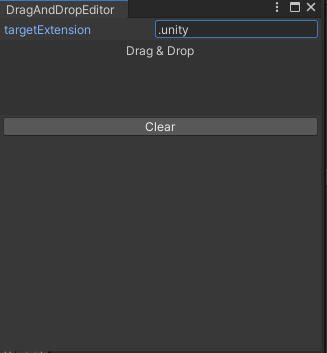

個人的に便利なDrag & Dropのエディタ拡張をメモ

## 完成図
完成系はこんな感じです、テスト用にターゲットとする拡張子を変更できるようにしてます。



<blockquote class="twitter-tweet"><p lang="ja" dir="ltr">記事用動画 <a href="https://t.co/4FRBhqSanw">pic.twitter.com/4FRBhqSanw</a></p>&mdash; 松本隆介 (@matsumotokaka11) <a href="https://twitter.com/matsumotokaka11/status/1304514846722068486?ref_src=twsrc%5Etfw">September 11, 2020</a></blockquote> 


## スクリプト


```csharp
using System.IO;
using System.Collections.Generic;
using System.Text;
using UnityEngine;
using UnityEngine.Events;
using UnityEditor;

namespace Sample
{
    public class DragAndDropEditor : EditorWindow
    {
        [MenuItem("Custom/DragAndDropEditor")]
        static void ShowWindow()
        {
            var window = GetWindow<DragAndDropEditor>();
            window.titleContent = new GUIContent("DragAndDropEditor");
        }

        
        // テスト用.
        StringBuilder stringBuilder = new StringBuilder(512);
        string targetExtension = ".unity";
        
        
        // UI描画.
        void OnGUI()
        {
            // テスト用,ターゲットの拡張子を変更する.
            targetExtension = EditorGUILayout.TextField("targetExtension", targetExtension);
            
            // 目的とするファイルの拡張子を指定してDrag & Dropの領域を描画する.
            // 複数ファイルドロップに対応し、指定した拡張子以外のファイルがマスクされた配列がコールバックで呼ばれる.
            DrawFileDragArea(
                GUILayoutUtility.GetRect(0.0f, 75.0f, GUILayout.ExpandWidth(true)),
                "Drag & Drop",
                targetExtension,
                (objs) =>
                {
                    stringBuilder.Clear();
                    foreach (var obj in objs)
                    {
                        stringBuilder.AppendLine(obj.name);
                    }
                });

            if (GUILayout.Button("Clear"))
            {
                stringBuilder.Clear();
            }
            
            // 取得したアイテムのリストを描画.
            EditorGUILayout.LabelField(stringBuilder.ToString(), GUILayout.Height(300));
        }


        /// <summary>
        /// ドラッグアンドドロップ領域を描画,コールバックで取得したオブジェクトを得る.
        /// </summary>
        /// <param name="dropArea"> Drag & Dropを受け付ける範囲. </param>
        /// <param name="dropAreaMessage"> Drag & Dropを受け付ける領域に描画する文字列. </param>
        /// <param name="targetFileExtension"> 目的のファイルの拡張子. </param>
        /// <param name="dropCallback"> Dropされた時のコールバック.  </param>
        /// <param name="visualMode"> マウスカーソルの見ため,基本的にGenericでよいと思われる. </param>
        private void DrawFileDragArea(
            Rect dropArea,
            string dropAreaMessage,
            string targetFileExtension,
            UnityAction<UnityEngine.Object[]> dropCallback,
            DragAndDropVisualMode visualMode = DragAndDropVisualMode.Generic)
        {
            Event evt = Event.current;
            GUI.Box(dropArea, dropAreaMessage);

            switch (evt.type)
            {
                // ドラッグ中.
                case EventType.DragUpdated:
                case EventType.DragPerform:
                    if (!dropArea.Contains(evt.mousePosition))  break;

                    // Dragされている間のカーソルの見た目を変更.
                    DragAndDrop.visualMode = visualMode;

                    if (evt.type == EventType.DragPerform)
                    {
                        // オブジェクトを受け入れる.
                        DragAndDrop.AcceptDrag();
                        if (0 < DragAndDrop.objectReferences.Length)
                        {
                            var dropObjects = new List<UnityEngine.Object>();
                            for (var i = 0; i < DragAndDrop.paths.Length; ++i)
                            {
                                if (Path.GetExtension(DragAndDrop.paths[i]) == targetFileExtension)
                                    dropObjects.Add(DragAndDrop.objectReferences[i]);
                            }

                            if (0 < dropObjects.Count)
                                dropCallback?.Invoke(dropObjects.ToArray());
                        }
                        DragAndDrop.activeControlID = 0;
                    }
                    Event.current.Use();
                    break;
            }
        }

    }    
}
```
