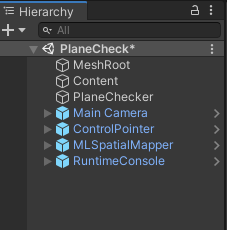
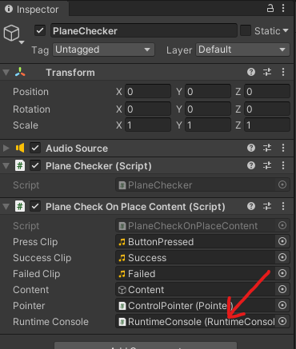
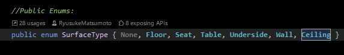
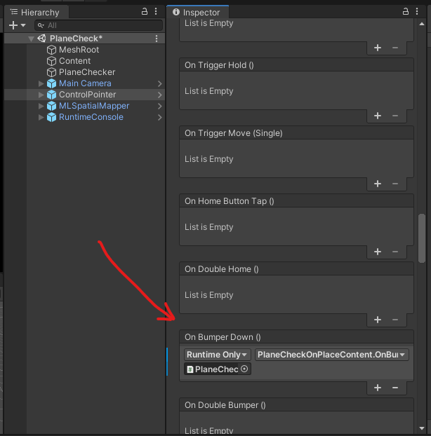

[ここの記事の続き : MagicLeapで床にオブジェクトを配置する方法](https://technical-protain.netlify.app/tech-1/teck-1/)

基本的な開発環境やシーンの構成は同じ


## 開発環境
Unity : 2019.3.7f1  
LuminOS : 0.98.11, APILevel 8  
MagicLeap : UnitySDK 0.24.1  
MagicLeap : ToolKit 特にバージョン表記等はないので現時点(2020/09/23)での最新

[MagicLeapToolKitのDLはこちらから](https://github.com/magicleap/Magic-Leap-Toolkit-Unity/blob/master/package/MagicLeap-Tools.unitypackage)  

今回開発したアプリの[リポジトリ](https://github.com/RyusukeMatsumoto7C9-B-2/MagicLeap-SandBox/tree/master/MagicLeapSandBox)はこちら  
PlaneCheckシーンにサンプルが配置してあります

---

## 完成するもの

<blockquote class="twitter-tweet"><p lang="ja" dir="ltr">任意の平面を判定するやつ <a href="https://t.co/bJ8k1Udb5k">pic.twitter.com/bJ8k1Udb5k</a></p>&mdash; 松本隆介 (@matsumotokaka11) <a href="https://twitter.com/matsumotokaka11/status/1308405945387675650?ref_src=twsrc%5Etfw">September 22, 2020</a></blockquote>

---

## 下準備

この辺りは前回の記事と同様なので飛ばしても大丈夫です

```ProjectSettings > MagicLeap > ManifestSettings```にて以下の項目にチェックを入れました

- ControllerPose
- LowLatencyLightwear
- WorldReconstruction


---

## シーンの構成



基本的には前回とはあまり変わってませんがどの平面を判定しているかを確認するためRuntimeConsoleを新たに追加しました

RuntimeConsoleは ```MagicLeap-Tools > Prefabs > Debugging``` にあるプレハブをシーン上に配置しています

PlaneCheckerオブジェクトにアタッチしているスクリプトで参照するので紐づけます


---

## スクリプト

前回作成したFloorCheckerをさらに改造したPlaneCheckerを作成します

```csharp
using System.Collections;
using System.Collections.Generic;
using UnityEngine;

#if PLATFORM_LUMIN
using UnityEngine.XR.MagicLeap;
#endif


namespace PlaneCheck
{
    /// <summary>
    /// MagicLeapToolsのFloorOnPlaceを改造したクラス.
    /// 任意の平面を判定する.
    /// </summary>
    public class PlaneChecker : MonoBehaviour
    {
        readonly float HeadLocationIdleThreshold = 0.003f;
        readonly float HeadRotationIdleThreshold = .3f;
        readonly int HistoryCount = 5;
        readonly float HeadIdleRequiredDuration = .2f;
        
        
        public Vector3 Location
        {
            get;
            private set;
        }
       
        List<Vector3> headLocationHistory;
        List<Quaternion> headRotationHistory;
        float headLocationVelocity;
        float headRotationVelocity;
        Transform mainCamera;
        bool headLocationIdle;
        bool headRotationIdle;
        bool headTemporarilyIdle;
        bool headIdle;
        bool placementValid;
 

        void Awake()
        {
            mainCamera = Camera.main.transform;
            
            if (FindObjectOfType<MLSpatialMapper>() == null)
            {
                Debug.LogError("PlaceOnFloor requires and instance of the MLSpatialMapper in your scene.");
            }
        }
        

        void OnEnable()
        {
            headLocationHistory = new List<Vector3>();
            headRotationHistory = new List<Quaternion>();
        }

        
        void Update()
        {
            if (Time.frameCount < 3)
            {
                return;
            }

            HeadActivityDetermination(); 
        }
        

        IEnumerator HeadIdleTimeout()
        {
            yield return new WaitForSeconds(HeadIdleRequiredDuration);
            headIdle = true;
        }

        
        void HeadActivityDetermination()
        {
            //history:
            headLocationHistory.Add(mainCamera.position);
            if (HistoryCount < headLocationHistory.Count)
                headLocationHistory.RemoveAt(0);

            headRotationHistory.Add(mainCamera.rotation);
            if (HistoryCount < headRotationHistory.Count)
                headRotationHistory.RemoveAt(0);

            //location velocity:
            if (headLocationHistory.Count == HistoryCount)
            {
                headLocationVelocity = 0;
                for (int i = 1; i < headLocationHistory.Count; i++)
                {
                    headLocationVelocity += Vector3.Distance(headLocationHistory[i], headLocationHistory[i - 1]);
                }
                headLocationVelocity /= headLocationHistory.Count;

                //idle detection:
                if (headLocationVelocity <= HeadLocationIdleThreshold)
                {
                    if (!headLocationIdle)
                    {
                        headLocationIdle = true;
                    }
                }
                else
                {
                    if (headLocationIdle)
                    {
                        headLocationIdle = false;
                    }
                }
            }

            //rotation velocity:
            if (headRotationHistory.Count == HistoryCount)
            {
                headRotationVelocity = 0;
                for (int i = 1; i < headRotationHistory.Count; i++)
                {
                    headRotationVelocity += Quaternion.Angle(headRotationHistory[i], headRotationHistory[i - 1]);
                }
                headRotationVelocity /= headRotationHistory.Count;

                //idle detection:
                if (headRotationVelocity <= HeadRotationIdleThreshold)
                {
                    if (!headRotationIdle)
                    {
                        headRotationIdle = true;
                    }
                }
                else
                {
                    if (headRotationIdle)
                    {
                        headRotationIdle = false;
                    }
                }
            }

            //absolute idle head determination:
            if (headLocationIdle && headRotationIdle)
            {
                if (!headTemporarilyIdle)
                {
                    headTemporarilyIdle = true;
                    StartCoroutine(HeadIdleTimeout());
                }
            }
            else
            {
                if (headTemporarilyIdle)
                {
                    headIdle = false;
                    headTemporarilyIdle = false;
                    StopCoroutine(HeadIdleTimeout());
                }
            }
        }
   
        
        /// <summary>
        /// 指定したRayの位置に任意の面があるか否か、ある場合はその座標も返す.
        /// </summary>
        /// <param name="ray"></param>
        /// <param name="surfaceType"></param>
        /// <returns></returns>
        public (bool, Vector3) LookingAtFloorDetermination(
            Ray ray,
            MagicLeapTools.SurfaceType surfaceType)
        {
            RaycastHit hit;
            if (Physics.Raycast(ray, out hit))
            {
                MagicLeapTools.SurfaceType surface = MagicLeapTools.SurfaceDetails.Analyze(hit);
                
                if (surface == surfaceType)
                {
                    Location = hit.point;
                    placementValid = true;
                    return (true, Location);
                }
                else
                {
                    placementValid = false;
                    return (false, Vector3.zero);
                }
            }
            else
            {
                placementValid = false;
                return (false, Vector3.zero);
            }
        }

        
    }
}
```

---

### この部分で任意の平面かの判定をとっています

```csharp
        /// <summary>
        /// 指定したRayの位置に任意の面があるか否か、ある場合はその座標も返す.
        /// </summary>
        /// <param name="ray"></param>
        /// <param name="surfaceType"></param>
        /// <returns></returns>
        public (bool, Vector3) LookingAtFloorDetermination(
            Ray ray,
            MagicLeapTools.SurfaceType surfaceType)
        {
            RaycastHit hit;
            if (Physics.Raycast(ray, out hit))
            {
                MagicLeapTools.SurfaceType surface = MagicLeapTools.SurfaceDetails.Analyze(hit);
                
                if (surface == surfaceType)
                {
                    Location = hit.point;
                    placementValid = true;
                    return (true, Location);
                }
                else
                {
                    placementValid = false;
                    return (false, Vector3.zero);
                }
            }
            else
            {
                placementValid = false;
                return (false, Vector3.zero);
            }
        }

```  

判定することが出来る平面はMagicLeapToolsのSurfaceDetils.csに定義されています  
今回のサンプルでは床、壁、天井の三種類を判定することにしました


---

### PlaneCheckerを利用するPlaneCheckOnPlaceContent.cs

基本的な構成は前回のFloorCheckOnPlaceContent.csとあまり変わっていません  
Bumperボタンを押下したら判定を切り替えるようにしています  
ControlPointerオブジェクトのControlInputにOnBumperButtonDown()を登録



```csharp
using MagicLeapTools;
using UnityEngine;

namespace PlaneCheck
{
    
    /// <summary>
    /// トリガを入力したときに任意の平面を判定し、床の場合はオブジェクトを配置するサンプル.
    /// </summary>
    [RequireComponent(typeof(PlaneChecker),typeof(AudioSource))]
    public class PlaneCheckOnPlaceContent : MonoBehaviour
    {

        [SerializeField] AudioClip pressClip;
        [SerializeField] AudioClip successClip;
        [SerializeField] AudioClip failedClip;
        [SerializeField] GameObject content;
        [SerializeField] Pointer pointer;
        [SerializeField] RuntimeConsole runtimeConsole;
        PlaneChecker planeChecker;
        AudioSource audio;
        SurfaceType[] surfaceTypes;
        int index = 0;

        void Start()
        {
            planeChecker = GetComponent<PlaneChecker>();
            audio = GetComponent<AudioSource>();

            // RuntimeConsoleに自分が指定した文字列だけ表示したい.
            runtimeConsole.errors = false;
            runtimeConsole.logs = false;
            runtimeConsole.warnings = false;

            // 今回はこの三種類のみをチェック.
            surfaceTypes = new[]
            {
                SurfaceType.Floor,   // 床.
                SurfaceType.Wall,    // 壁.
                SurfaceType.Ceiling, // 天井.
            };
        }


        public void OnBumperButtonDown()
        {
            index = (int)Mathf.Repeat(index + 1, surfaceTypes.Length);
            runtimeConsole.logText.text = surfaceTypes[index].ToString();
        }


        public void OnTriggerDown()
        {
            audio.PlayOneShot(pressClip);
            (bool onSurfaceType, Vector3 pos ) result = planeChecker.LookingAtFloorDetermination(new Ray(pointer.Origin, pointer.Direction), surfaceTypes[index]);
            if (result.onSurfaceType)
            {
                audio.PlayOneShot(successClip);
                content.transform.position = result.pos;
            }
            else
            {
                audio.PlayOneShot(failedClip);
            }
        }


    }
}
```

---

## 完成

これでデプロイ or ZeorIterationで確認すれば↓の様な動作になります  
ただしRuntimeConsoleは実機にデプロイ時にしか動作しないので実機での確認のほうがどの平面を判定しているかがわかりやすいです


<blockquote class="twitter-tweet"><p lang="ja" dir="ltr">任意の平面を判定するやつ <a href="https://t.co/bJ8k1Udb5k">pic.twitter.com/bJ8k1Udb5k</a></p>&mdash; 松本隆介 (@matsumotokaka11) <a href="https://twitter.com/matsumotokaka11/status/1308405945387675650?ref_src=twsrc%5Etfw">September 22, 2020</a></blockquote>

--- 

## 感想

これで任意の平面にオブジェクトを配置したりできるようになりました  
なんか家具の配置確認アプリ的なもので天井にランプをつるすとか、壁に絵を飾るとかの確認に使うのがメイン所の使い方かな?

