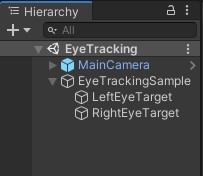
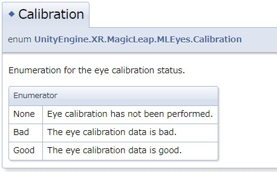

# 開発環境

| SDK等 | バージョン |
| ---- | ---- |
| OS | Windows10 |
| Unity | 2019.3.7f1 |
| LuminOS | 0.98.11 |
| LuminSDK | 0.24.1 |
| MagicLeap-ToolKit | 2020/09/27時点での最新( 特にバージョン表記がない為 ) |


# サンプル動画

<blockquote class="twitter-tweet"><p lang="ja" dir="ltr">Eyeトラッキングのチョットしたサンプル作ってみた <a href="https://t.co/C8afUckEHO">pic.twitter.com/C8afUckEHO</a></p>&mdash; 松本隆介 (@matsumotokaka11) <a href="https://twitter.com/matsumotokaka11/status/1311716435530407936?ref_src=twsrc%5Etfw">October 1, 2020</a></blockquote>


なおこのサンプルはアプリの停止処理を入れてないので別途導入するか或いはThe Labからアプリを停止することをお勧めします

今回のサンプルは[こちらのリポジトリ](https://github.com/RyusukeMatsumoto7C9-B-2/MagicLeap-SandBox)、EyeTrackingシーンに作成してあります


# シーン構成

今回は超簡単サンプルということでシーンの構成も簡単にしました



# スクリプト

今回のサンプルでは右目の目線の先に青いキューブ、左目の目線の先に赤いキューブを配置し、瞬きしたら効果音を鳴らすサンプルです


```csharp
using UnityEngine;
using UnityEngine.XR.MagicLeap;

namespace EyeTracking
{
    public class EyeTrackingSample : MonoBehaviour
    {
        readonly float TargetDistance = 2f;

        [SerializeField] Transform leftEyeTarget;
        [SerializeField] Transform rightEyeTarget;
        [SerializeField] AudioSource audioSource;
        [SerializeField] AudioClip blinkSound;
        
        
        void Start()
        {
            MLEyes.Start();
        }


        void OnDestroy()
        {
            MLEyes.Stop();
        }

        
        void Update()
        {
            if (!MLEyes.IsStarted) return;

            switch (MLEyes.CalibrationStatus)
            {
                case MLEyes.Calibration.Bad:
                    leftEyeTarget.gameObject.SetActive(false);
                    rightEyeTarget.gameObject.SetActive(false);
                    break;
                
                case MLEyes.Calibration.Good:
                    leftEyeTarget.gameObject.SetActive(true);
                    rightEyeTarget.gameObject.SetActive(true);
                    leftEyeTarget.position = MLEyes.LeftEye.Center + (MLEyes.LeftEye.ForwardGaze.normalized * TargetDistance);
                    rightEyeTarget.position = MLEyes.RightEye.Center + (MLEyes.RightEye.ForwardGaze.normalized * TargetDistance);

                    if ((MLEyes.LeftEye.IsBlinking || MLEyes.RightEye.IsBlinking) && !audioSource.isPlaying)
                        audioSource.PlayOneShot(blinkSound);
                    break; 
                
                case MLEyes.Calibration.None:
                    leftEyeTarget.gameObject.SetActive(false);
                    rightEyeTarget.gameObject.SetActive(false);
                    break;
            }

        }
    }
}

```

## コードの解説

Start()にあるMLEyes.Start()でEyeトラッキング用のモジュールを起動します
```csharp
void Start()
{
    MLEyes.Start();
}

```

OnDestroy()でモジュールを停止します
```csharp
void OnDestroy()
{
    MLEyes.Stop();
}
```


メインの処理はこちらになります
Update()では一応モジュールが起動していない場合は処理をスキップするようにしておきます
```csharp
void Update()
{
    if (!MLEyes.IsStarted) return;

    switch (MLEyes.CalibrationStatus)
    {
        case MLEyes.Calibration.Bad:
            leftEyeTarget.gameObject.SetActive(false);
            rightEyeTarget.gameObject.SetActive(false);
            break;
        
        case MLEyes.Calibration.Good:
            leftEyeTarget.gameObject.SetActive(true);
            rightEyeTarget.gameObject.SetActive(true);
            leftEyeTarget.position = MLEyes.LeftEye.Center + (MLEyes.LeftEye.ForwardGaze.normalized * TargetDistance);
            rightEyeTarget.position = MLEyes.RightEye.Center + (MLEyes.RightEye.ForwardGaze.normalized * TargetDistance);
            if ((MLEyes.LeftEye.IsBlinking || MLEyes.RightEye.IsBlinking) && !audioSource.isPlaying)
                audioSource.PlayOneShot(blinkSound);
            break; 
        
        case MLEyes.Calibration.None:
            leftEyeTarget.gameObject.SetActive(false);
            rightEyeTarget.gameObject.SetActive(false);
            break;
    }

}

```

目のキャリブレーションの状態が悪い時とそもそものキャリブレーションが取れていないときはターゲットとなるオブジェクトを非表示にしています
キャリブレーションが取れている場合は左右それぞれの目の正面方向( 今回は2m前方 )にオブジェクトを配置し、瞬きをしたら効果音を再生するようにしています

---

```csharp
if ((MLEyes.LeftEye.IsBlinking || MLEyes.RightEye.IsBlinking) && !audioSource.isPlaying)
    audioSource.PlayOneShot(blinkSound);
```
勘のいいひとはこれで気づくかもしれませんが瞬きの判定は瞬きした瞬間ではなく瞼を閉じている間になっています、そのため効果音を再生中は効果音を再生しないようにして多重に再生されるのを防いでいます
しばらく目をつぶっているとキャリブレーションの判定がNoneに遷移して処理がスキップされるようになります

---

## 簡単なMLEyes周りの紹介

MLEyesは左右の目の情報を管理するクラスです、これ自体はシングルトンクラスなのでインスタンス化の必要はなく左右それぞれの目へのアクセスも

```csharp
MLEyes.LeftEye
MLEyes.RightEye
```
このメンバーでアクセスが可能です


アイトラッキングのキャリブレーションの状態は以下のようにアクセスできます
```csharp

switch (MLEyes.CalibrationStatus)
{
    case MLEyes.Calibration.Bad:
        // キャリブレーションの状態が悪い.
        break;
    
    case MLEyes.Calibration.Good:
        // キャリブレーションの状態が良好.
        break; 
    
    case MLEyes.Calibration.None:
        // キャリブレーションできていない.
        break;
}


```

API Referenceにはこのように記述されています


---

~~The Labから見られるAPIのドキュメントバージョンが更新されていないのかMLEyeについての情報が手探りですが簡単な紹介を以下にしておきます~~  
API Referenceを参照したい場合は[Developer Portal](https://developer.magicleap.com/learn/reference/public/v0.24.0/UnityAPI/index.html)の方を参照したほうがいいですね
尚左目のみ紹介します( 右目のプロパティ等も同様の構成の為 )

```csharp
MLEyes.LeftEye.Center
```

---

目の中心座標

```csharp
MLEyes.LeftEye.Gaze
```
目の回転Gazeとありますが視線の方向を撮りたいときは以下のプロパティから取得したほうが直感的です、本サンプルでもこちらを利用しています

```csharp
MLEyes.LeftEye.ForwardGaze
```

---

目のタイプ、右か左かのタイプです
現時点で既にプロパティとしてLeftEye、RightEyeとあるので利用することは無いと思います

```csharp
MLEyes.LeftEye.Type
```

---

アイトラッキングの情報の信頼性
0 で目を閉じているまたはデバイスをかぶっていない、最初の更新時は0で初期化されています

```csharp
MLEyes.LeftEye.CenterConfidence
```

---

瞬きしているか否か、trueで瞬き( どちらかというと瞼を閉じている )の判定になります

```csharp
MLEyes.LeftEye.IsBlinking
```

